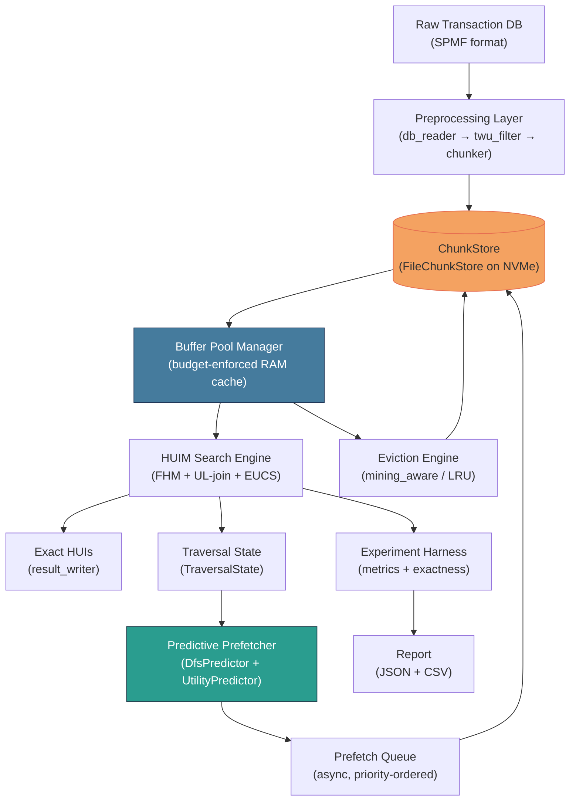
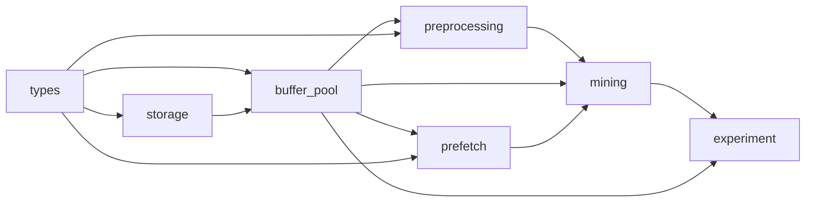

# Air-HUIM: Implementation Plan

## Goal Description

Build **Air-HUIM** — a research-grade, exact High-Utility Itemset Mining (HUIM) engine in Rust that decouples RAM requirements from dataset size through a traversal-aware, disk-backed buffer-pool architecture.

The core idea: RAM is a **strictly bounded working-set cache**. The complete mining state lives on disk (NVMe). Only the active working set is resident in RAM. Eviction and prefetching are *mining-aware* — not generic LRU.

Priority order: **Exactness > Memory Efficiency > I/O Efficiency > Execution Time**

The existing codebase is a blank Rust 2024-edition project (`pocket-data-mining`) with a single `fn main()` stub. Everything must be built from scratch.

---

## User Review Required

> [!IMPORTANT]
> The plan is organized into **7 top-level modules** (Parts), each broken into sub-modules. Approve the decomposition and any design decisions highlighted below before implementation begins.

> [!WARNING]
> This is a large research system. Implementing all 7 parts completely is weeks of work. The plan below is fully specified so that each part can be independently implemented, tested, and merged. Confirm whether you want to implement all parts in one shot or phase-by-phase.

> [!CAUTION]
> The `buffer_pool` module uses **unsafe Rust** for pinned frame management (raw pointers for zero-copy access to frames). All unsafe blocks will be isolated, documented, and tested with Miri or address-sanitizer where feasible.

---

## Open Questions

> [!IMPORTANT]
> **Q1 — Utility-list algorithm**: The spec calls for exact HUIM. Should the core search engine implement **HUI-Miner** (utility-list intersection) or **FHM** (EUCS pruning on top of HUI-Miner)? FHM is more pruning-aggressive and thus produces smaller working sets (better for buffer pool). **Recommendation: FHM.**

USE FHM but we must implement Aprirori, FP Growth and Eclat (their High utility miningset algorithms completely end to end on any given dataset, for exam Online Retail II)

> [!IMPORTANT]
> **Q2 — Storage backend for ChunkStore**: Raw binary files per chunk vs. a single memory-mapped file with a free-list. Memory-mapped files simplify addressing but can cause the OS to cache pages outside our budget. **Recommendation: raw per-chunk binary files** so Air-HUIM controls all I/O explicitly.
Lets try with our recommendation, will change it if it doesnt perform properly.
> [!IMPORTANT]
> **Q3 — Async runtime**: `tokio` vs `async-std` vs manual `io_uring` (via `rio` or `tokio-uring`). For NVMe predictive prefetch, `io_uring` gives lowest latency. **Recommendation: `tokio` with `tokio-uring` feature-flagged for Linux; fallback to `tokio` async FS on Windows/Mac.**
We'll worry about platforms later, right now we need to build it on windows first
> [!IMPORTANT]
> **Q4 — Recompute vs. Materialize decision**: Should the recompute oracle be a heuristic cost model (simple, interpretable) or learned online? **Recommendation: heuristic first**, parameterized so an ML model can replace it later.

Right now lets keept it ML model but im planning to use Caching and stuff so we dont have to recompute it at all. We can either pre compute or just take inspiration from Dynamic Programming.

---

## Proposed Changes

The repository will be restructured into the following module hierarchy:

```
src/
├── main.rs                    ← CLI entry point, config parsing
├── config.rs                  ← MemoryBudget, ExperimentConfig
│
├── types/                     ← Part 1 — Core Type System
│   ├── mod.rs
│   ├── transaction.rs         ← Transaction, Item, Utility primitives
│   ├── utility_list.rs        ← UtilityList, ULEntry (the mining structure)
│   └── page.rs               ← PageId, PageMeta, FrameHeader
│
├── storage/                   ← Part 2 — Persistent ChunkStore
│   ├── mod.rs
│   ├── chunk_store.rs         ← ChunkStore trait + FileChunkStore impl
│   ├── page_layout.rs         ← Binary serialization format for pages
│   └── compression.rs        ← Optional LZ4 compression layer
│
├── buffer_pool/               ← Part 3 — Buffer Pool Manager (core systems piece)
│   ├── mod.rs
│   ├── frame.rs               ← Frame, PinGuard (RAII pin/unpin)
│   ├── pool.rs               ← BufferPool: pin/unpin/evict/flush
│   ├── eviction/
│   │   ├── mod.rs
│   │   ├── policy.rs          ← EvictionPolicy trait
│   │   ├── lru.rs             ← LRU baseline eviction
│   │   └── mining_aware.rs    ← Mining-aware composite eviction score
│   └── metrics.rs             ← BufferPoolMetrics (hits, misses, evictions…)
│
├── prefetch/                  ← Part 4 — Predictive Prefetcher
│   ├── mod.rs
│   ├── predictor.rs           ← AccessPredictor trait
│   ├── dfs_predictor.rs       ← DFS-traversal-aware deterministic predictor
│   ├── utility_predictor.rs   ← Utility-aware priority (ExpectedBenefit formula)
│   └── prefetch_queue.rs      ← Async prefetch queue + io_uring integration
│
├── preprocessing/             ← Part 5 — Preprocessing Layer
│   ├── mod.rs
│   ├── db_reader.rs           ← Parse HUIM transaction databases (CSV/SPMF format)
│   ├── twu_filter.rs          ← Transaction-Weighted Utilization filter
│   └── chunker.rs             ← Segment transactions into pages, write to ChunkStore
│
├── mining/                    ← Part 6 — HUIM Search Engine
│   ├── mod.rs
│   ├── fhm.rs                 ← FHM algorithm (exact, buffer-pool-backed)
│   ├── ul_join.rs             ← Utility-list intersection (core HUIM operation)
│   ├── eucs.rs                ← Estimated Utility Co-occurrence Structure (pruning)
│   ├── traversal.rs           ← DFS traversal state machine (feeds Prefetcher)
│   └── result_writer.rs       ← Stream HUIs to output file
│
└── experiment/                ← Part 7 — Experiment Harness & Metrics
    ├── mod.rs
    ├── runner.rs              ← Run mining under configured budget, collect metrics
    ├── metrics_collector.rs   ← Structured metrics: time, RAM, I/O, cache rates…
    ├── exactness_checker.rs   ← Diff Air-HUIM output vs. reference output
    └── report.rs              ← Emit JSON / CSV report for analysis
```

---

### ─────────────────────────────────────────────────────
### Part 1 — Core Type System (`src/types/`)

**Reasoning**: Every module depends on these types. Zero-cost abstractions, no heap indirection except where necessary. Design for cache-line awareness.

#### [MODIFY] main.rs
Becomes a thin CLI dispatcher only.

#### [NEW] types/mod.rs
Re-exports all public types.

#### [NEW] types/transaction.rs

```rust
/// Item identifier — fits in a u32 (supports up to ~4B items).
pub type ItemId = u32;

/// Utility value — i64 to support negative utilities.
pub type Utility = i64;

/// A single item+utility pair inside a transaction.
#[repr(C)]
pub struct ItemEntry {
    pub item: ItemId,
    pub utility: Utility,
}

/// A transaction is a contiguous slice reference (zero-copy from mapped page).
pub struct Transaction<'a> {
    pub tid: u32,
    pub transaction_utility: Utility,
    pub items: &'a [ItemEntry],
}
```

- **Memory note**: `ItemEntry` is `#[repr(C)]` so slices cast directly from page bytes — zero-copy deserialization.
- TWU (transaction-weighted utility) is stored per-transaction for filter step.

#### [NEW] types/utility_list.rs

```rust
/// One entry in a utility list.
/// iutils = internal utility of item in tx.
/// rutils = remaining utility after item in tx.
#[repr(C, packed)]
pub struct ULEntry {
    pub tid: u32,
    pub iutils: Utility,
    pub rutils: Utility,
}

/// A utility list header (resident in RAM, body may be on disk).
pub struct UtilityList {
    pub itemset: SmallVec<[ItemId; 8]>, // prefix + item, stack-allocated for small itemsets
    pub sum_iutils: Utility,
    pub sum_rutils: Utility,
    pub len: u32,
    pub page_id: PageId,               // where the ULEntry[] body lives on disk
    pub resident: bool,                // is the body currently in the buffer pool?
}
```

- **Memory note**: `SmallVec<[ItemId; 8]>` avoids heap allocation for itemsets up to depth 8. Most HUIM workloads never exceed this.
- The header (≈ 60 bytes) is always in RAM. Only the `ULEntry[]` body is paged.

#### [NEW] types/page.rs

```rust
pub type PageId = u64;

/// Frame-level metadata stored alongside each page in the buffer pool.
pub struct PageMeta {
    pub page_id: PageId,
    pub size_bytes: u32,
    pub dirty: bool,
    pub pin_count: u16,
    pub last_access_tick: u64,
    pub access_count: u32,
    pub predicted_access_prob: f32,   // set by Prefetcher
    pub traversal_depth: u16,
    pub reload_cost_ns: u32,          // estimated I/O cost to reload
    pub recompute_cost_ns: u32,       // estimated CPU cost to recompute
    pub parent_page: Option<PageId>,
}
```

- `f32` for probability — 4 bytes, good enough for scoring.
- Costs stored as `u32` nanoseconds — supports up to ~4 seconds per operation.
- Total struct size: ≈ 48 bytes per page. For 1M pages that's 48 MB metadata — acceptable.

---

### ─────────────────────────────────────────────────────
### Part 2 — Persistent ChunkStore (`src/storage/`)

**Reasoning**: The ground truth of the mining state. Must be correct, sequential-write-friendly, and support O(1) random page reads by `PageId`.

#### [NEW] storage/chunk_store.rs

```rust
pub trait ChunkStore: Send + Sync {
    fn write_page(&self, id: PageId, data: &[u8]) -> io::Result<()>;
    fn read_page(&self, id: PageId, buf: &mut Vec<u8>) -> io::Result<()>;
    fn delete_page(&self, id: PageId) -> io::Result<()>;
    fn page_exists(&self, id: PageId) -> bool;
}
```

**`FileChunkStore` implementation**:
- Root directory contains one file per page: `{root}/{page_id >> 16}/{page_id}.chunk`
- Two-level directory sharding avoids single-directory inode explosion (65535 subdirs × 65535 files).
- On write: `O_DIRECT | O_SYNC` for bypass of OS page cache → Air-HUIM owns all caching.
- On read: standard read into a pre-allocated `Vec<u8>` from the buffer pool's frame allocator.

#### [NEW] storage/page_layout.rs

Binary layout of a serialized page:

```
Offset  Size  Field
0       4     magic: 0xA1_RH_U1_M  (Air-HUIM magic)
4       8     page_id
12      4     payload_len (compressed)
16      4     payload_crc32
20      1     flags (bit0 = compressed, bit1 = ul_body, bit2 = tx_chunk)
21      3     reserved
24      N     payload bytes
```

- CRC32 on every page prevents silent corruption.
- `flags` byte distinguishes transaction chunk pages from utility-list body pages.

#### [NEW] storage/compression.rs

- Optional LZ4 compression (feature-flagged: `features = ["compress"]`).
- Utility-list bodies are highly compressible (sorted TID sequences, delta-encoded).
- Compression decision: if `payload_len_compressed < payload_len_raw * 0.85` → store compressed.

---

### ─────────────────────────────────────────────────────
### Part 3 — Buffer Pool Manager (`src/buffer_pool/`)

**Reasoning**: The *central systems component* per the spec. Must enforce a strict byte-level RAM budget. Must be correct under concurrent access (mining thread + async prefetch thread).

#### [NEW] buffer_pool/frame.rs

```rust
/// A frame is one slot in the buffer pool — a fixed-size or variable-size byte region.
pub struct Frame {
    data: Box<[u8]>,         // actual page data — owned here
    pub meta: PageMeta,
}

/// RAII guard: automatically unpins the frame when dropped.
pub struct PinGuard<'pool> {
    page_id: PageId,
    pool: &'pool BufferPool,
    data_ptr: *const u8,
    len: usize,
}

impl<'pool> Deref for PinGuard<'pool> {
    type Target = [u8];
    fn deref(&self) -> &[u8] { unsafe { std::slice::from_raw_parts(self.data_ptr, self.len) } }
}

impl Drop for PinGuard<'_> {
    fn drop(&mut self) { self.pool.unpin(self.page_id); }
}
```

- `PinGuard` is the safe interface. Unsafe pointer is bounded by the guard's lifetime.
- `pin_count` in `PageMeta` is atomically incremented — page cannot be evicted while pinned.

#### [NEW] buffer_pool/pool.rs

```rust
pub struct BufferPool {
    budget_bytes: usize,
    used_bytes: AtomicUsize,
    frames: RwLock<HashMap<PageId, Frame>>,
    eviction_policy: Box<dyn EvictionPolicy>,
    store: Arc<dyn ChunkStore>,
    metrics: Arc<BufferPoolMetrics>,
}

impl BufferPool {
    pub fn pin(&self, page_id: PageId) -> io::Result<PinGuard<'_>>;
    pub fn prefetch(&self, page_id: PageId);       // async, non-blocking
    pub fn mark_dirty(&self, page_id: PageId);
    pub fn flush(&self, page_id: PageId) -> io::Result<()>;
    pub fn evict_one(&self) -> Option<PageId>;     // evict lowest-score page
    pub fn budget_remaining(&self) -> usize;
}
```

**Budget enforcement**:
```
On pin(page_id):
  1. If already resident → increment pin_count, return PinGuard.
  2. Compute page size from store metadata.
  3. While used_bytes + page_size > budget_bytes:
       evict_one() → flush if dirty → remove from frames → subtract from used_bytes
  4. Read page from ChunkStore into new Frame.
  5. Add to frames, add page_size to used_bytes.
  6. Return PinGuard.
```

- **No malloc after startup**: frame data regions are drawn from a pre-allocated slab allocator (optional optimization — Phase 2).

#### [NEW] buffer_pool/eviction/lru.rs

Pure LRU baseline — ordered by `last_access_tick`. Used as **Baseline 2** in experiments.

#### [NEW] buffer_pool/eviction/mining_aware.rs

The composite eviction score (higher = evict sooner):

```rust
pub fn eviction_score(meta: &PageMeta, current_tick: u64) -> f32 {
    let recency   = (current_tick - meta.last_access_tick) as f32;
    let freq      = 1.0 / (1.0 + meta.access_count as f32);
    let p_future  = 1.0 - meta.predicted_access_prob;   // low prob → evict
    let reload_cost_penalty = 1.0 / (1.0 + meta.reload_cost_ns as f32 * 1e-6);

    // Weights tuned experimentally; stored in Config
    W_RECENCY * recency
  + W_FREQ    * freq
  + W_FUTURE  * p_future
  - W_RELOAD  * reload_cost_penalty   // subtract: expensive to reload → resist eviction
}
```

- Weights `W_*` are runtime-configurable to support ablation experiments.
- Pinned pages (`pin_count > 0`) are **never scored** — they cannot be evicted.

#### [NEW] buffer_pool/metrics.rs

```rust
pub struct BufferPoolMetrics {
    pub hits:              AtomicU64,
    pub misses:            AtomicU64,
    pub evictions:         AtomicU64,
    pub dirty_flushes:     AtomicU64,
    pub prefetch_issued:   AtomicU64,
    pub prefetch_useful:   AtomicU64,
    pub prefetch_wasted:   AtomicU64,
    pub bytes_read:        AtomicU64,
    pub bytes_written:     AtomicU64,
    pub peak_used_bytes:   AtomicU64,
}
```

All metrics are `AtomicU64` — lock-free, suitable for concurrent mining+prefetch threads.

---

### ─────────────────────────────────────────────────────
### Part 4 — Predictive Prefetcher (`src/prefetch/`)

**Reasoning**: Hides I/O latency. Key novel contribution per the spec. Start deterministic; leave hooks for learned models.

#### [NEW] prefetch/predictor.rs

```rust
pub trait AccessPredictor: Send + Sync {
    /// Given current traversal state, return (page_id, priority) pairs.
    fn predict(&self, state: &TraversalState) -> Vec<(PageId, f32)>;
}
```

#### [NEW] prefetch/dfs_predictor.rs

Deterministic DFS-aware predictor:

```rust
pub struct DfsPredictor;

impl AccessPredictor for DfsPredictor {
    fn predict(&self, state: &TraversalState) -> Vec<(PageId, f32)> {
        // For a DFS node at depth D with candidate extensions [e1, e2, ...]:
        // → predict that the next few candidates' UL body pages will be needed.
        // → assign higher priority to candidates with higher TWU (likely high-utility).
        // → deprioritize siblings already processed (their pages won't be revisited).
        let mut preds = Vec::new();
        for (i, ext) in state.extensions.iter().enumerate() {
            let priority = 1.0 / (1.0 + i as f32); // decay by position
            preds.push((ext.ul_page_id, priority));
        }
        preds
    }
}
```

#### [NEW] prefetch/utility_predictor.rs

Utility-aware predictor — implements the **ExpectedBenefit** formula:

```rust
pub struct UtilityPredictor;

impl AccessPredictor for UtilityPredictor {
    fn predict(&self, state: &TraversalState) -> Vec<(PageId, f32)> {
        state.extensions.iter().map(|ext| {
            let p_access = ext.twu_ratio;            // normalized TWU
            let expected_value = ext.estimated_utility as f32;
            let load_cost = ext.estimated_load_cost_ns as f32 * 1e-9;
            let benefit = p_access * expected_value / (1.0 + load_cost);
            (ext.ul_page_id, benefit)
        }).collect()
    }
}
```

This isolates **Baseline 3** (DFS only) vs. **full system** (utility-aware) as described in the spec.

#### [NEW] prefetch/prefetch_queue.rs

```rust
pub struct PrefetchQueue {
    sender: mpsc::Sender<(PageId, f32)>,    // (page, priority)
}

// Background task: dequeue by priority, issue async reads into buffer pool.
// Uses tokio::task::spawn_blocking wrapping synchronous I/O,
// or tokio-uring on Linux for true async.
```

- The queue is a `BinaryHeap` ordered by priority — highest-benefit pages load first.
- Already-resident pages are silently dropped from the queue.
- Prefetch is **best-effort** — never blocks the mining engine.

---

### ─────────────────────────────────────────────────────
### Part 5 — Preprocessing Layer (`src/preprocessing/`)

**Reasoning**: One-time setup that converts raw SPMF-format transaction databases into disk-resident page chunks. Must be streaming (never loads entire DB into RAM at once).

#### [NEW] preprocessing/db_reader.rs

Streaming reader for SPMF format:
```
<item1> <item2> ... <itemN>:<transaction_utility>:<utility1> <utility2> ... <utilityN>
```

```rust
pub struct DbReader<R: BufRead> {
    reader: R,
    tid: u32,
}

impl<R: BufRead> Iterator for DbReader<R> {
    type Item = io::Result<RawTransaction>;
    fn next(&mut self) -> Option<Self::Item> { /* parse one line */ }
}
```

- Streaming line-by-line. RAM usage: O(max transaction size), not O(database size).

#### [NEW] preprocessing/twu_filter.rs

Single pass over `DbReader`:
1. Compute TWU for each item.
2. Filter items below `min_utility` threshold.
3. Re-order items by ascending TWU (standard HUI-Miner ordering).
4. Produce `FilteredItem` mapping: original → filtered ID space.

RAM usage: one `HashMap<ItemId, Utility>` for TWU — proportional to unique item count, not transaction count.

#### [NEW] preprocessing/chunker.rs

Second pass: chunk the filtered DB into pages:

```rust
pub struct Chunker<'s> {
    store: &'s dyn ChunkStore,
    page_size_bytes: usize,       // configurable: 64KB default
    current_page: Vec<u8>,
    current_page_id: PageId,
}
```

- Transactions are packed into pages ≤ `page_size_bytes`.
- A `PageDirectory` struct (saved to `chunks/directory.bin`) maps `tid_range → page_id`.
- All writes are sequential → maximizes NVMe throughput during preprocessing.

---

### ─────────────────────────────────────────────────────
### Part 6 — HUIM Search Engine (`src/mining/`)

**Reasoning**: The algorithmic core. FHM algorithm with all I/O routed through the buffer pool. The engine must *never* touch the ChunkStore directly — only through `BufferPool::pin()`.

#### [NEW] mining/fhm.rs

Top-level FHM driver:

```rust
pub struct Fhm<'pool> {
    pool: &'pool BufferPool,
    prefetcher: Arc<PrefetchQueue>,
    config: MiningConfig,
    result_writer: ResultWriter,
    metrics: Arc<MiningMetrics>,
}

impl<'pool> Fhm<'pool> {
    pub fn mine(&mut self) -> io::Result<()> {
        // 1. Load 1-itemset utility lists (pinned, always resident).
        // 2. For each item in TWU-ascending order:
        //      self.search(prefix=[], extension=item)
        Ok(())
    }

    fn search(&mut self, prefix: &[ItemId], extensions: &[UtilityList]) -> io::Result<()> {
        // Update TraversalState → notify Prefetcher of upcoming extensions.
        // For each extension X:
        //   pin(X.page_id) → get UL body
        //   if sum_iutils + sum_rutils >= min_utility:
        //     compute new_extensions by joining X with each Y after X
        //     recursively call search(prefix + X, new_extensions)
        //   unpin(X.page_id)  // PinGuard drops here
    }
}
```

#### [NEW] mining/ul_join.rs

Core utility-list intersection:

```rust
/// Join two utility lists to produce a new one (written to ChunkStore via buffer pool).
pub fn join_utility_lists(
    prefix: &UtilityList,
    px:     &UtilityList,
    py:     &UtilityList,
    pool:   &BufferPool,
    store:  &dyn ChunkStore,
) -> io::Result<UtilityList>;
```

- Three-pointer merge on sorted TID sequences.
- Joined result is streamed directly to a new page in ChunkStore — never fully buffered in RAM.
- **Recompute-vs-materialize decision** happens here: if `py.len * ENTRY_SIZE < recompute_threshold` and `py.estimated_recompute_cost < py.reload_cost` → mark page as `Recomputable` instead of writing to disk.

#### [NEW] mining/eucs.rs

Estimated Utility Co-occurrence Structure — a 2D upper-bound matrix pruning join candidates:

```rust
pub struct Eucs {
    inner: HashMap<(ItemId, ItemId), Utility>,
}

impl Eucs {
    pub fn can_prune(&self, x: ItemId, y: ItemId, min_utility: Utility) -> bool {
        self.inner.get(&(x, y)).copied().unwrap_or(0) < min_utility
    }
}
```

- Computed during preprocessing from single-item utility lists (one-time cost).
- Stored as a compact `HashMap` in RAM — much smaller than the utility lists themselves.
- For very large item sets, can itself be paged, but this is an extension.

#### [NEW] mining/traversal.rs

```rust
/// Captures the exact DFS traversal state at any point.
pub struct TraversalState {
    pub prefix:       SmallVec<[ItemId; 16]>,
    pub depth:        u16,
    pub extensions:   Vec<ExtensionInfo>,   // candidates at this node
}

pub struct ExtensionInfo {
    pub item:                 ItemId,
    pub ul_page_id:           PageId,
    pub twu_ratio:            f32,
    pub estimated_utility:    Utility,
    pub estimated_load_cost_ns: u32,
}
```

`TraversalState` is passed to the `Prefetcher` at each DFS node — this is the signal that drives prediction.

#### [NEW] mining/result_writer.rs

Streams discovered HUIs to an output file without buffering them in RAM:

```rust
pub struct ResultWriter {
    writer: BufWriter<File>,
    count: u64,
}

impl ResultWriter {
    pub fn write_hui(&mut self, itemset: &[ItemId], utility: Utility) -> io::Result<()>;
    pub fn finalize(self) -> io::Result<u64>; // returns HUI count
}
```

Output format: one HUI per line, `item1 item2 ... itemN #UTIL: U` (SPMF-compatible).

---

### ─────────────────────────────────────────────────────
### Part 7 — Experiment Harness (`src/experiment/`)

**Reasoning**: Scientific reproducibility requires structured, automated experiment execution and output. Every metric from the spec (§15) must be captured.

#### [NEW] experiment/runner.rs

```rust
pub struct ExperimentRunner {
    config: ExperimentConfig,
}

impl ExperimentRunner {
    pub fn run_all(&self) -> Vec<ExperimentResult>;
    pub fn run_one(&self, budget: MemoryBudget, dataset: &Path) -> ExperimentResult;
}
```

Iterates over the cross-product of `{budget} × {dataset}` from config.

#### [NEW] experiment/metrics_collector.rs

Collects every metric from spec §15:

```rust
pub struct ExperimentResult {
    pub budget_bytes:        usize,
    pub dataset_path:        PathBuf,
    pub wall_time_secs:      f64,
    pub peak_rss_bytes:      usize,       // measured via /proc/self/status or GetProcessMemoryInfo
    pub buffer_pool_bytes:   usize,
    pub cache_hit_rate:      f64,
    pub cache_miss_rate:     f64,
    pub page_loads:          u64,
    pub evictions:           u64,
    pub prefetch_issued:     u64,
    pub prefetch_useful:     u64,
    pub prefetch_wasted:     u64,
    pub bytes_read:          u64,
    pub bytes_written:       u64,
    pub hui_count:           u64,
    pub exact:               bool,        // verified against reference
}
```

#### [NEW] experiment/exactness_checker.rs

```rust
pub fn verify_exactness(
    reference_output: &Path,
    air_huim_output:  &Path,
) -> ExactnessResult;

pub struct ExactnessResult {
    pub false_negatives: usize,
    pub false_positives: usize,
    pub utility_mismatches: usize,
    pub exact: bool,
}
```

- Parses both files into `HashSet<(Vec<ItemId>, Utility)>`.
- Set difference in both directions.
- **Does not rely on counts alone** — per spec §12.

#### [NEW] experiment/report.rs

Emits results as:
- `report.json` — machine-readable, one entry per experiment configuration.
- `report.csv`  — for spreadsheet analysis.
- Console summary table.

---

## System Architecture Diagram



---

## Module Dependency Order (Build Order)



Build and test bottom-up: `types → storage → buffer_pool → preprocessing → prefetch → mining → experiment`.

---

## Memory Budget Reasoning

| Component | RAM Size | Rationale |
|---|---|---|
| UL Headers (`UtilityList` structs) | ~60 bytes × N_active | Always resident; tiny vs. body |
| `PageMeta` entries | ~48 bytes × N_pages_in_pool | Proportional to pool size |
| EUCS matrix | O(k²) where k=unique items after TWU filter | Pre-computed once |
| `TraversalState` | ~(16+N_ext)×ext_size bytes | Stack depth × branching factor |
| Frame data | Budget − all metadata | The bulk of the allocation |
| Prefetch queue | Bounded at startup | Fixed-size circular buffer |

Total non-frame metadata for 1M pages: ≈ 100 MB. For a 1 GB budget → ~900 MB frames. This is measurable and reportable.

---

## Cargo.toml Changes

```toml
[package]
name = "pocket-data-mining"
version = "0.1.0"
edition = "2024"

[[bin]]
name = "air-huim"
path = "src/main.rs"

[[bin]]
name = "air-huim-preprocess"
path = "src/bin/preprocess.rs"

[features]
default = ["compress"]
compress = ["lz4_flex"]
io_uring = ["tokio-uring"]

[dependencies]
tokio = { version = "1", features = ["full"] }
serde = { version = "1", features = ["derive"] }
serde_json = "1"
csv = "1"
smallvec = { version = "1", features = ["union"] }
lz4_flex = { version = "0.11", optional = true }
crc32fast = "1"
clap = { version = "4", features = ["derive"] }
parking_lot = "0.12"
crossbeam-channel = "0.5"
tracing = "0.1"
tracing-subscriber = "0.3"

[target.'cfg(target_os = "linux")'.dependencies]
tokio-uring = { version = "0.4", optional = true }

[dev-dependencies]
tempfile = "3"
proptest = "1"
```

---

## Verification Plan

### Automated Tests

```powershell
# Unit tests for all modules
cargo test --all

# Integration test: preprocess small dataset, mine, verify exactness
cargo test --test integration_exact

# Run with address sanitizer (requires nightly + Linux)
RUSTFLAGS="-Z sanitizer=address" cargo +nightly test --target x86_64-unknown-linux-gnu

# Benchmark buffer pool throughput under different budgets
cargo bench --bench buffer_pool_bench
```

### Key Test Cases

| Test | What it validates |
|---|---|
| `test_page_layout_roundtrip` | Write+read a page → identical bytes |
| `test_budget_enforcement` | Buffer pool never exceeds configured budget |
| `test_pin_prevents_eviction` | Pinned page is never evicted |
| `test_ul_join_correctness` | Joined UL matches reference result |
| `test_fhm_exactness_small` | FHM output == reference HUIM on small DB |
| `test_exactness_checker` | Checker detects 1 false negative/positive |
| `test_prefetch_useful_rate` | Utility predictor > DFS predictor on cache hits |

### Manual Verification

1. Run `air-huim-preprocess` on a known dataset (e.g., FOODMART from SPMF benchmark).
2. Run reference HUI-Miner (Java SPMF) on same dataset.
3. Run `air-huim` at 8 GB → 1 GB budgets.
4. At each budget: `exactness_checker` must report `exact: true`.
5. Observe `cache_hit_rate` decreasing and `bytes_read` increasing as budget shrinks.
6. Confirm RSS (via Task Manager / `/proc`) never exceeds configured budget + metadata overhead.

---

> [!NOTE]
> Parts 1–3 (types, storage, buffer pool) form the **foundation layer** and should be implemented first before any HUIM-specific code. This allows the buffer pool to be tested in isolation with synthetic pages before being connected to the mining engine.
